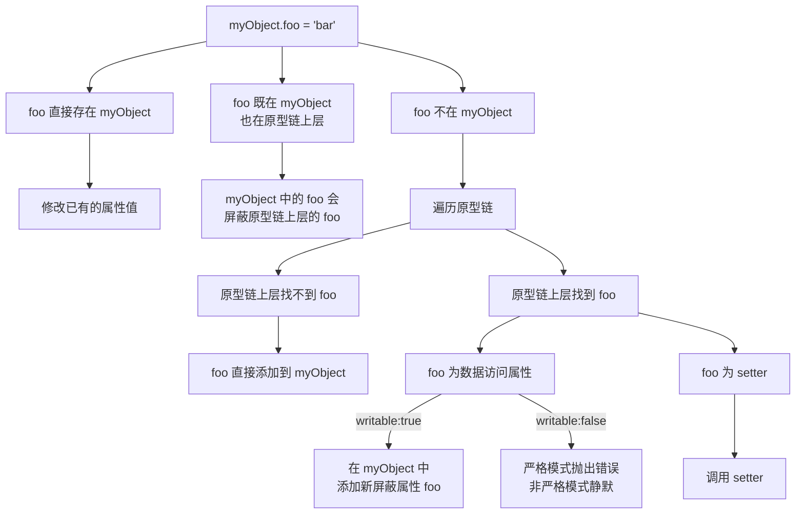

### 5.1 [[Prototype]]

JavaScript 中的对象有一个特殊的 [[Prototype]] 内置属性，是对其他对象的引用

通过各种语法进行属性查找时都会查找 [[Prototype]] 链，直到找到属性或者查找完整条原型链

###### 5.1.1 Object.prototype

[[Prototype]] 链最终都会指向内置的 Object.prototype

Object.prototype 内置通用方法如 .toString() 、.valueOf()、.hasOwnProperty(..)、.isPrototypeOf(..) 等

###### 5.1.2 属性设置和屏蔽

给一个对象设置属性的过程：



> 只有在 = 赋值时，只读属性会阻止 [[Prototype]] 链下层隐式创建（屏蔽）同名属性，使用 Object.defineProperty(..) 并不会受到影响

```javascript
var anotherObject = {
	a:2
};

var myObject = Object.create( anotherObject );

anotherObject.a; // 2
myObject.a; // 2

anotherObject.hasOwnProperty( "a" ); // true
myObject.hasOwnProperty( "a" ); // false

myObject.a++; // 隐式屏蔽！

anotherObject.a; // 2
myObject.a; // 3

myObject.hasOwnProperty( "a" ); // true
```

myObject.a++（myObject.a = myObject.a + 1）的赋值操作发生了隐式屏蔽

### 5.2 “类”

JavaScript 才是真正应该被称为“面向对象”的语言， 和面向类的语言不同，它并没有类来作为对象的抽象模式
或者说蓝图

JavaScript 中只有对象

###### 5.2.1 "类" 函数

所有的函数默认都会拥有一个名为 prototype 的公有并且不可枚举的属性，它会指向另一个对象

```javascript
function Foo() {
	// ...
}
Foo.prototype; // { }
```

这个对象通常被称为 Foo 的原型，它是在调用 new Foo() 时创建的

```javascript
function Foo() {
	// ...
}
var a = new Foo(); // 将 a 内部的 [[Prototype]] 链接到 Foo.prototype 所指向的对象
Object.getPrototypeOf( a ) === Foo.prototype; // true
```

继承意味着复制操作，JavaScript（默认）并不会复制对象属性

JavaScript 会在两个对象之间创建一个关联，这样一个对象就可以通过**委托**访问另一个对象的属性和函数

###### 5.2.2 “构造函数”

new 和 大写的 F 让我们把 Foo 联系到类，产生其为“构造函数”的语义

```javascript
function Foo() {
	// ...
}

// Foo 声明时会生成一个公有并且不可枚举 .constructor，该属性引用的是对象关联的函数
Foo.prototype.constructor === Foo; // true

var a = new Foo();
// 调用 new Foo() 创建的对象也有一个 .constructor 属性，指向“创建这个对象的函数”
a.constructor === Foo; // true
```

>实际上 a 本身并没有 .constructor 属性。而且，虽然 a.constructor 确实指向 Foo 函数，但是这个属性并不是表示 a 由 Foo“构造”

1. 构造函数还是调用

   函数不是构造函数，当且仅当使用 new 关键字时，函数调用会变成“构造函数调用”

###### 5.2.3 技术

```javascript
function Foo(name) {
	this.name = name;
}

Foo.prototype.myName = function() {
return this.name;
};

var a = new Foo( "a" );
var b = new Foo( "b" );

a.myName(); // "a"
b.myName(); // "b"
```

1. this.name = name 给每个对象都添加了 .name 属性，有点像类实例封装的数据值
2. Foo.prototype.myName = ... 给 Foo.prototype 对象添加 myName 属性（函数），在创建的过程中，a 和 b 的内部 [[Prototype]] 都会关联到 Foo.prototype 上。当 a 和 b 中无法找到 myName 时，会通过委托在 Foo.prototype 上找到

**回顾“构造函数”**

 a.constructor === Foo 中 a.constructor 只是通过默认的 [[Prototype]] 委托指向 Foo

```javascript
function Foo() { /* .. */ }

Foo.prototype = { /* .. */ }; // 创建一个新原型对象

var a1 = new Foo();
a1.constructor === Foo; // false!
a1.constructor === Object; // true!
```

a1 并没有 .constructor 属性，所以它会委托 [[Prototype]] 链上的 Foo.prototype。但是这个对象也没有 .constructor 属性（不过默认的 Foo.prototype 对象有这个属性！），所以它会继续委托，这次会委托给委托链顶端的 Object.prototype。这个对象有 .constructor 属性，指向内置的 Object(..) 函数

```javascript
function Foo() { /* .. */ }

Foo.prototype = { /* .. */ }; // 创建一个新原型对象

// 需要在 Foo.prototype 上“修复”丢失的 .constructor 属性
// 新对象属性起到 Foo.prototype 的作用
Object.defineProperty( Foo.prototype, "constructor" , {
	enumerable: false,
	writable: true,
	configurable: true,
	value: Foo // 让 .constructor 指向 Foo
} );
```

.constructor 不可枚举的，但是它的值是可写的。此外，你可以给任意 [[Prototype]] 链中的任意对象添加一个名为 constructor 的属性或者对其进行修改，你可以任意对其赋值

### （原型）继承

```javascript
function Foo(name) {
	this.name = name;
}

Foo.prototype.myName = function() {
	return this.name;
};

function Bar(name,label) {
	Foo.call( this, name );
	this.label = label;
}

// 我们创建了一个新的 Bar.prototype 对象并关联到 Foo.prototype
Bar.prototype = Object.create( Foo.prototype );

// 注意！现在没有 Bar.prototype.constructor 了
// 如果你需要这个属性的话可能需要手动修复一下它

Bar.prototype.myLabel = function() {
	return this.label;
};

var a = new Bar( "a", "obj a" );

a.myName(); // "a"
a.myLabel(); // "obj a"
```

```javascript
# 不好的方法
// 和你想要的机制不一样！它只是让 Bar.prototype 直接引用 Foo.prototype 对象 
Bar.prototype = Foo.prototype;
// 基本上满足你的需求，但是可能会产生一些副作用
Bar.prototype = new Foo();
# 正确方法
// ES6 之前需要抛弃默认的 Bar.prototype，唯一的缺点就是需要创建一个新对象然后把旧对象抛弃掉
Bar.ptototype = Object.create( Foo.prototype );
// ES6 开始可以直接修改现有的 Bar.prototype
Object.setPrototypeOf( Bar.prototype, Foo.prototype );
```

###### 检查 “类” 关系

传统面向类语言检查一个实例（JavaScript 中的对象）的继承祖先（JavaScript 中的委托关联）通常被称为内省（或者反射）

```javascript
var a = new Foo()
```

1. instanceof

   ```javascript
   a instanceof Foo; // true
   ```

   在 a 的整条 [[Prototype]] 链中是否有指向 Foo.prototype 的对象

2. isPrototypeOf

   ```javascript
   Foo.prototype.isPrototypeOf( a ); // true
   ```

   在 a 的整条 [[Prototype]] 链中是否出现过 Foo.prototype 

获取一个对象的 [[Prototype]] 链

```javascript
// ES5
Object.getPrototypeOf( a )
```

```javascript
// 非标准
a.__proto__ === Foo.prototype; // true		
```

（JavaScript 潮人的非官方叫法笨蛋(dunder) proto）__proto__ 存在于内置的 Object.prototype（不可枚举）

```javascript
// __proto__ 实现
Object.defineProperty( Object.prototype, "__proto__", {
	get: function() {
		return Object.getPrototypeOf( this );
	},
	set: function(o) {
	// ES6 中的 setPrototypeOf(..)
	Object.setPrototypeOf( this, o );
		return o;
	}
});
```

### 对象关联

原型链

```mermaid
graph LR
	A[[Prototype]];
	对象--未找到属性或方法-->A关联对象上查找--未找到属性或方法-->它的A关联对象上查找--...--;
```

###### 5.4.1 创建关联

[[Prototype]] 机制的意义？

```javascript
var foo = {
	something: function() {
		console.log( "Tell me something good..." );
	}
};

var bar = Object.create( foo );

bar.something(); // Tell me something good...
```

>Object.create(null) 会创建一个拥有空（或者说 null）[[Prototype]]链接的对象，这个对象无法进行委托。由于这个对象没有原型链，所以 instanceof 操作符无法进行判断，因此总是会返回 false。
>这些特殊的空 [[Prototype]] 对象通常被称作“字典”，它们完全不会受到原型链的干扰，因此非常适合用来存储数据

```javascript
// Object.create()的polyfill代码
if (!Object.create) {
	Object.create = function(o) {
		function F(){}
		F.prototype = o;
		return new F();
	};
}
```

Object.create 的第二个参数是需要添加到新对象中的属性名以及这些属性的属性描述符， ES5 之前的版本无法模拟属性操作符，所以第二个参数无法 polyfill，但在大多数场景下上面的 polyfill 足够

###### 5.4.2 关联关系是备用

可以使用 [[Prototype]] 处理“缺失”属性或者方法时的一种备用选项，但这不是其本质目的

```javascript
var anotherObject = {
	cool: function() {
		console.log( "cool!" );
	}
};

var myObject = Object.create( anotherObject );

myObject.cool(); // "cool!"
```

> ES6 中有一个被称为“代理”（Proxy）的高端功能，它实现的就是“方法无法找到”时的行为

当你给开发者设计软件时，假设要调用 myObject.cool()，如果 myObject 中不存在 cool() 时这条语句也可以正常工作的话，那你的 API 设计就会变得很“神奇”，对于未来维护你软件的开发者来说这可能不太好理解

```javascript
var anotherObject = {
	cool: function() {
		console.log( "cool!" );
	}
};

var myObject = Object.create( anotherObject );

myObject.doCool = function() {
	this.cool(); // 内部委托！
};

myObject.doCool(); // "cool!"
```

委托设计模式：通过 [[Prototype]] 委托到 anotherObject.cool()，让 API 接口设计更加清晰

### 小结

访问对象中不存在的一个属性，[[Get]] 操作就会查找对象内部 [[Prototype]] 关联的对象，遍历“原型链”

所有普通对象都有内置的 Object.prototype （存在 toString()、valueOf() 和其他一些通用的功能），指向原型链的顶端（比如说全局作用域），如果在原型链中找不到指定的属性就会停止

关联两个对象最常用的方法是使用 new 关键词进行函数调用，在调用的 4 个步骤中会创建一个关联其他对象的新对象
使用 new 调用函数时会把新对象的 .prototype 属性关联到“其他对象”

带 new 的函数调用通常被称为“构造函数调用”，实际上和传统面向类语言中的类构造函数不一样

虽然这些 JavaScript 机制和传统面向类语言中的“类初始化”和“类继承”很相似，但是 JavaScript 中的机制有一个核心区别，那就是不会进行复制，对象之间是通过内部的 [[Prototype]] 链关联的

以“继承”结尾的术语（包括“原型继承”）和其他面向对象的术语都无法帮助你理解 JavaScript 的真实机制（不仅仅是限制我们的思维模式）。相比之下，“委托”是一个更合适的术语，因为对象之间的关系不是复制而是委托