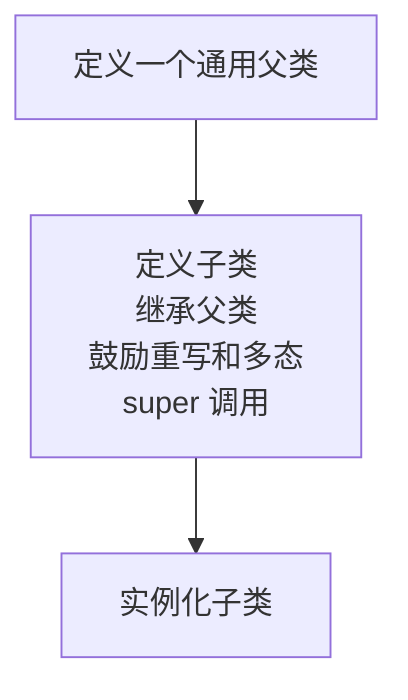

JavaScript 中 [[Prototype]] 机制的本质就是对象之间的关联关系

### 6.1 面向委托的设计

从类和继承的设计模式转换到委托行为的设计模式

###### 6.1.1 类理论



```java
class Task {
	id;
	// 构造函数 Task()
	Task(ID) { id = ID; }
	outputTask() { output( id ); }
}

class XYZ inherits Task {
	label;
	// 构造函数 XYZ()
	XYZ(ID,Label) { super( ID ); label = Label; }
	outputTask() { super(); output( label ); }
}

class ABC inherits Task {
	// ...
}
```

###### 6.1.2 委托理论

```javascript
Task = {
	setID: function(ID) { this.id = ID; },
	outputID: function() { console.log( this.id ); }
};

// 让 XYZ 委托 Task
XYZ = Object.create( Task );

XYZ.prepareTask = function(ID,Label) {
	this.setID( ID );
	this.label = Label;
};

XYZ.outputTaskDetails = function() {
	this.outputID();
	console.log( this.label );
};

// ABC = Object.create( Task );
// ABC ... = ...
```

1. [[Prototype]] 委托中最好把状态保存在委托者（XYZ、ABC）而不是委托目标（Task）上
2. 在类设计模式中，父类和子类会有重名方法，这样就可以利用重写（多态）的优势；在委托行为中则恰好相反：我们会尽量避免在 [[Prototype]] 链的不同级别中使用相同的命名，使用更有描述性的自说明方法名
3. 委托者（XYZ）中的方法首先会寻找自身，没有则会通过 [[Prototype]] 委托关联到委托目标（这里的 Task）继续寻找，这时就可以找到对应方法，调用位置触发了 this 的隐式绑定规则，从而正确得绑定到（XYZ）

###### 1. 互相委托（禁止）

互相委托问题：如果引用了一个两边都不存在的属性或者方法，就会在 [[Prototype]] 链上产生一个无限递归的循环

在设置时检查（并禁止！）一次无限循环引用要更加高效，否则每次从对象中查找属性时都需要进行检查

###### 2. 调试

JavaScript 规范并不会控制浏览器中开发者工具对于特定值或者结构的表示方式，浏览器和引擎可以自己选择合适的方式来进行解析，因此浏览器和工具的解析结果并不一定相同

###### 6.1.3 比较思维模型

###### “原型”）面向对象风格：

```javascript
function Foo(who) {
	this.me = who;
}
Foo.prototype.identify = function() {
	return "I am " + this.me;
};

function Bar(who) {
	Foo.call( this, who );
}
Bar.prototype = Object.create( Foo.prototype );

Bar.prototype.speak = function() {
	alert( "Hello, " + this.identify() + "." );
};

var b1 = new Bar( "b1" );
var b2 = new Bar( "b2" );

b1.speak();
b2.speak();	
```

类风格代码的思维模型：


强调实体以及实体间的关系

简化版，展示了必要的对象和关系：


###### 对象关联风格：

```javascript
Foo = {
	init: function(who) {
		this.me = who;
	},
	identify: function() {
		return "I am " + this.me;
	}
};
Bar = Object.create( Foo );

Bar.speak = function() {
	alert( "Hello, " + this.identify() + "." );
};

var b1 = Object.create( Bar );
b1.init( "b1" );
var b2 = Object.create( Bar );
b2.init( "b2" );
b1.speak();
b2.speak();
```

思维模型：


### 6.2 类与对象

在真实场景中应用“类”和“行为委托”：

###### 6.2.1 控件“类”

```javascript
// 父类
function Widget(width,height) {
    this.width = width || 50;
    this.height = height || 50;
	this.$elem = null;
}

Widget.prototype.render = funvtion($where) {
    if(this.$elem) {
        this.$elem.css({
            width: this.width + 'px'
            height: this.height + 'px'
        }).appendTo($where)
    }
}

// 子类
function Button(width,height) {
    // 调用 “super” 构造函数
    Widget.call(this,width,height);
    this.label = label || 'Defalut';
    
    this.$elem = $('<button>').text(this.label);
}

// 让 Button “继承” Widget
Button.prototype = Object.create(Widget.prototype);

// 重新 render()
Button.prototype.render = function($where) {
    // “super” 调用
    Widget.prototype.render.call(this,$where)
    this.$elem.click(this.onClick.bind(this))
}

Button.prototype.onClick = function(evt) {
    console.log("'Button'" + this.label + "'clicked'")
}

$( document ).ready( function(){
	var $body = $( document.body );
	var btn1 = new Button( 125, 30, "Hello" );
	var btn2 = new Button( 150, 40, "World" );
	btn1.render( $body );
	btn2.render( $body );
} );
```

在面向对象设计模式中我们需要先在父类中定义基础的 render(..)，然后在子类中重写它。子类并不会替换基础的 render(..)，只是添加一些按钮特有的行为。
可以看到代码中出现了丑陋的显式伪多态，即通过 Widget.call 和 Widget.prototype.render.call 从“子类”方法中引用“父类”中的基础方法

ES6 的 class 语法糖：

```javascript
class Widget {
	constructor(width,height) {
		this.width = width || 50;
		this.height = height || 50;
		this.$elem = null;
	}
	render($where){
		if (this.$elem) {
			this.$elem.css( {
				width: this.width + "px",
				height: this.height + "px"
			}).appendTo( $where );
		}
	}
}

class Button extends Widget {
	constructor(width,height,label) {
		super( width, height );
		this.label = label || "Default";
		this.$elem = $( "<button>" ).text( this.label );
	}
	render($where) {
		super.render( $where );
		this.$elem.click( this.onClick.bind( this ) );
	}
	onClick(evt) {
		console.log( "Button '" + this.label + "' clicked!" );
	}
}
```

语法糖，基于 [[Prototype]]，思维模式不匹配等

###### 6.2.2 委托控件对象

```javascript
var Widget = {
	init(width,height) {
		this.width = width || 50;
		this.height = height || 50;
		this.$elem = null;
	}
	insert($where){
		if (this.$elem) {
			this.$elem.css( {
				width: this.width + "px",
				height: this.height + "px"
			}).appendTo( $where );
		}
	}
}

var Button = Object.create(Widget)

Button.setup = function(width,height,label){
	// 委托调用
	this.init( width, height );
	this.label = label || "Default";
	this.$elem = $( "<button>" ).text( this.label );
};
Button.build = function($where) {
    // 委托调用
	this.insert( $where );
	this.$elem.click( this.onClick.bind( this ) );
};

Button.onClick = function(evt) {
    console.log("'Button'" + this.label + "'clicked'")
}

$( document ).ready( function(){
	var $body = $( document.body );
    
	var btn1 = Object.create( Button );
	btn1.setup( 125, 30, "Hello" );
    
	var btn2 = Object.create( Button );
	btn2.setup( 150, 40, "World" );
    
	btn1.build( $body );
	btn2.build( $body );
} );
```

1. Widget 和 Button 没有父子之分
2. 使用不相同并且更具描述性的方法名（insert(..) 和 build(..)），init(..) 和 setup(..)
3. 避免丑陋的显式伪多态调用
4. 没有使用任何构造函数、.prototype 或 new

对象关联可以更好地支持关注分离（separation of concerns）原则，创建和初始化并不需要合并为一个步骤

### 6.3 更简洁的设计

对象关联简化整体设计：

传统设计模式

```javascript
// 父类
function Controller() {
	this.errors = [];
}
Controller.prototype.showDialog = function(title,msg) {
	// 给用户显示标题和消息
};
Controller.prototype.success = function(msg) {
	this.showDialog( "Success", msg );
};
Controller.prototype.failure = function(err) {
	this.errors.push( err );
	this.showDialog( "Error", err );
};

// 子类
function LoginController() {
	Controller.call( this );
}
// 把子类关联到父类
LoginController.prototype = Object.create( Controller.prototype );
LoginController.prototype.getUser = function() {
	return document.getElementById( "login_username" ).value;
};
LoginController.prototype.getPassword = function() {
	return document.getElementById( "login_password" ).value;
};
LoginController.prototype.validateEntry = function(user,pw) {
    user = user || this.getUser();
	pw = pw || this.getPassword();
    if (!(user && pw)) {
        return this.failure(
    	    "Please enter a username & password!"
        );
    }
    else if (pw.length < 5) {
        return this.failure(
        	"Password must be 5+ characters!"
        );
    }
    // 如果执行到这里说明通过验证
    return true;
};
// 重写基础的 failure()
LoginController.prototype.failure = function(err) {
    // “super”调用
    Controller.prototype.failure.call(
    	this,
    	"Login invalid: " + err
    );
};

// 子类
function AuthController(login) {
    Controller.call( this );
    // 合成
    this.login = login;
}
// 把子类关联到父类
AuthController.prototype = Object.create( Controller.prototype );
AuthController.prototype.server = function(url,data) {
    return $.ajax( {
        url: url,
        data: data
    });
};
AuthController.prototype.checkAuth = function() {
    var user = this.login.getUser();
    var pw = this.login.getPassword();
    if (this.login.validateEntry( user, pw )) {
        this.server( "/check-auth",{
            user: user,
            pw: pw
        } )
	    .then( this.success.bind( this ) )
		.fail( this.failure.bind( this ) );
    }
};
// 重写基础的 success()
AuthController.prototype.success = function() {
	// “super”调用
    Controller.prototype.success.call( this, "Authenticated!" );
};
// 重写基础的 failure()
AuthController.prototype.failure = function(err) {
    // “super”调用
    Controller.prototype.failure.call(
        this,
        "Auth Failed: " + err
    );
};

var auth = new AuthController(
    // 除了继承，我们还需要合成
    new LoginController()
);
auth.checkAuth();
```

###### 反类

使用对象关联风格的行为委托来实现更简单的设计：

```javascript
var LoginController = {
    errors: [],
    getUser: function() {
        return document.getElementById(
            "login_username"
        ).value;
    },
    getPassword: function() {
        return document.getElementById(
        	"login_password"
        ).value;
    },
    validateEntry: function(user,pw) {
        user = user || this.getUser();
        pw = pw || this.getPassword();
        
        if (!(user && pw)) {
            return this.failure(
            "Please enter a username & password!"
        	);
		}
        else if (pw.length < 5) {
            return this.failure(
             "Password must be 5+ characters!"
            );
        }
        
        // 如果执行到这里说明通过验证
        return true;
    },
    showDialog: function(title,msg) {
    	// 给用户显示标题和消息
    },
    failure: function(err) {
        this.errors.push( err );
        this.showDialog( "Error", "Login invalid: " + err );
	}
};
// 让 AuthController 委托 LoginController
var AuthController = Object.create( LoginController );

AuthController.errors = [];
AuthController.checkAuth = function() {
    var user = this.getUser();
    var pw = this.getPassword();
    
    if (this.validateEntry( user, pw )) {
        this.server( "/check-auth",{
            user: user,
            pw: pw
        } )
		.then( this.accepted.bind( this ) )
		.fail( this.rejected.bind( this ) );
    }
};
AuthController.server = function(url,data) {
    return $.ajax( {
        url: url,
        data: data
    } );
};
AuthController.accepted = function() {
	this.showDialog( "Success", "Authenticated!" )
};
AuthController.rejected = function(err) {
	this.failure( "Auth Failed: " + err );
};
```

除了前文说的好处，这种模式的重点在于只需要两个实体（LoginController 和 AuthController），而前面的模式需要三个

### 6.4 更好的语法

ES6 class

```javascript
var LoginController = {
    errors: [],
    getUser() { // 妈妈再也不用担心代码里有 function 了！
    	// ...
    },
    getPassword() {
    	// ...
    }
    // ...
};	
```

ES6 提供 Object.setPrototypeOf(..) 来修改它的 [[Prototype]]

```javascript
// 使用更好的对象字面形式语法和简洁方法
var AuthController = {
    errors: [],
    checkAuth() {
   		// ...
    },
    server(url,data) {
    	// ...
    }
    // ...
};

// 现在把 AuthController 关联到 LoginController
Object.setPrototypeOf( AuthController, LoginController );
```

###### 反词法

在“作用域和闭包”中我们分析了匿名函数表达式的三大主要缺点：

1. 调试栈更难追踪；
2. 自我引用（递归、事件（解除）绑定，等等）更难；
3. 代码（稍微）更难理解。

简洁方法没有第 1 和第 3 个缺点

```javascript
var Foo = {
    bar() { /*..*/ }, // 简洁方法
    baz: function baz() { /*..*/ }
};
```

### 6.5 内省

内省就是检查实例的类型

类实例的内省主要目的是通过创建方式来判断对象的结构和功能

想检查一个对象和某个对象的关系，那必须使用另一个引用该对象的函数才行

```javascript
function Foo() { /* .. */ }
Foo.prototype...

function Bar() { /* .. */ }
Bar.prototype = Object.create( Foo.prototype );

var b1 = new Bar( "b1" );

// 让 Foo 和 Bar 互相关联
Bar.prototype instanceof Foo; // true
Object.getPrototypeOf( Bar.prototype ) === Foo.prototype; // true
Foo.prototype.isPrototypeOf( Bar.prototype ); // true

// 让 b1 关联到 Foo 和 Bar
b1 instanceof Foo; // true
b1 instanceof Bar; // true
Object.getPrototypeOf( b1 ) === Bar.prototype; // true
Foo.prototype.isPrototypeOf( b1 ); // true
Bar.prototype.isPrototypeOf( b1 ); // true
```

还有一种更加脆弱的内省模式——“鸭子类型”（“如果看起来像鸭子，叫起来像鸭子，那就一定是鸭子。”）

```javascript
if (a1.something) {
	a1.something();
}
```

ES6 的 Promise 就是典型的“鸭子类型”，通常判断一个对象引用是否是 Promise 的方法是检查它是否有 then() 方法，如果对象有 then() 方法，ES6 的 Promise 就会认为这个对象是“可持续”（thenable）的，因此会期望它具有 Promise 的所有标准行为。

如果有一个不是 Promise 但是具有 then() 方法的对象，那你千万不要把它用在 ES6 的 Promise 机制中，否则会出错——“鸭子类型”的危害（尽量避免使用这个方法，或保证条件是可控的）

对象关联风格代码的内省：

```javascript
var Foo = { /* .. */ };
var Bar = Object.create( Foo );
Bar...
var b1 = Object.create( Bar );

// 让 Foo 和 Bar 互相关联
Foo.isPrototypeOf( Bar ); // true
Object.getPrototypeOf( Bar ) === Foo; // true
  
// 让 b1 关联到 Foo 和 Bar
Foo.isPrototypeOf( b1 ); // true
Bar.isPrototypeOf( b1 ); // true
Object.getPrototypeOf( b1 ) === Bar; // true
```

JavaScript 中对象关联比类风格的代码更加简洁（而且功能相同）

### 6.6 小结

在软件架构中除了使用类和继承设计模式，还有另外一种少见但更强大的设计模式——行为委托

行为委托认为对象之间是兄弟关系，互相委托，而不是父类和子类的关系。JavaScript 的 [[Prototype]] 机制本质上就是行为委托机制

当只用对象来设计代码时，不仅可以让语法更加简洁，而且可以让代码结构更加清晰